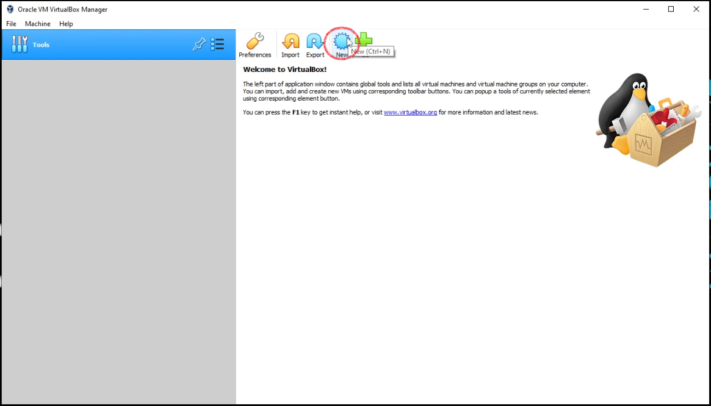
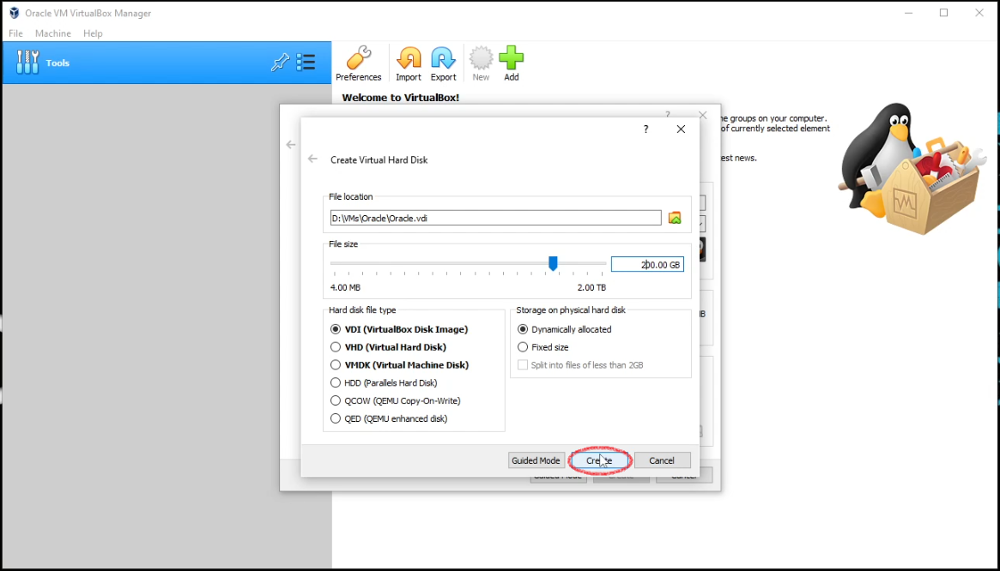

# Getting started with **Oracle Linux** [oracle] | [download] | [virtualbox]

**Below, you will find, a detailed walkthrough installation of Oracle Linux in Virtualbox.  This was done using VirtualBox version 6.1.32, and Oracle Linux 8.5 on February 4, 2022. Please [email] me with any questions, concerns, or feedback. `Please note: this is with absolute beginners in mind.`**

 

## Start by downloading the tools:

Locate the appropriate Oracle Linux ISO, [download], for your setup.

Download the latest [virtualbox] binary. `(Skip if you already have Virtualbox)`

Install Virtualbox `(Again, skip if you already have)`

---
 

## Install Oracle Linux in VirtualBox:

You'll want to begin by opening up Virtualbox.  Click `new` as outlined with a `red circle` below.

 </a>&nbsp; &nbsp; 

 

I'll be using `expert mode` in my installation.  Below you may observe the following:

## Name and Operating System
- Name: Oracle
    - `Name this whatever you like`
- Machine Folder: D:\VMs
    - `Store your virtual machine in a location that has available space.  In my situation I use a dedicated solid state drive for virtual machines, which is, what my D:\ is in this scenario.`
- Type: Linux
    - `This is a Linux distro`
- Version: Oracle(64-bit)
    - `This will work if you select other choices; however, Oracle is the version so I do suggest using it.`

Memory Size
- Select the amount of memory you are able to dedicate to the virtual machine.  In my case I've selected `8192 mb` which is about *8gb* of memory.

Hard Disk
- For the purpose of this walkthrough, I am, *`creating a new virtual disk`*.

Click `Create` as outlined in red below.

 </a>&nbsp; &nbsp; 

 

## Create Virtual Hard Disk

File Location:
- Ensure this matches the location you would like to store the `virtual disk`.

File Size:
- Set the amount that you are able to allocate to your virtual machine.
    - I select `200gb`, but this is for my own use case. _**`Don't`** let this determine your selection_.

Hard Disk File Type
- I'm usinng `VDI`
    - *This may vary for your use case. Refer to documentation regarding questions/concerns*.

Storage on physical hard disk
- I'll be using `Dynamically Allocated`
    - If you have a use case for `Fixed Size` then use that.

Continue by clicking by clicking `Create` after reviewing the information, and ensuring the settings to be satisfactory.

 </a>&nbsp; &nbsp; 

 

---

[oracle]: https://www.oracle.com/linux/
[download]: https://yum.oracle.com/oracle-linux-isos.html
[virtualbox]: https://www.virtualbox.org/wiki/Downloads
[email]: attacktheosi@gmail.com

