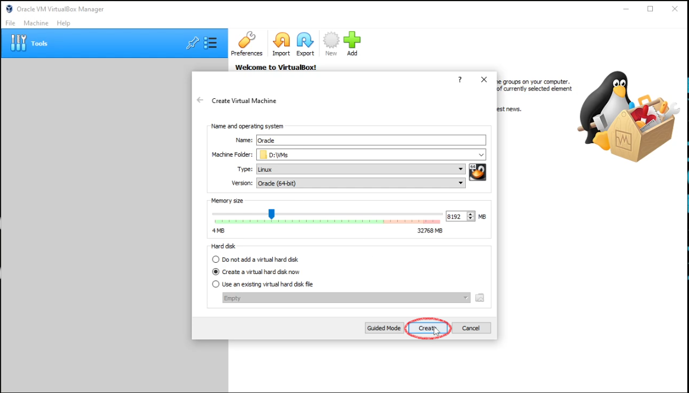
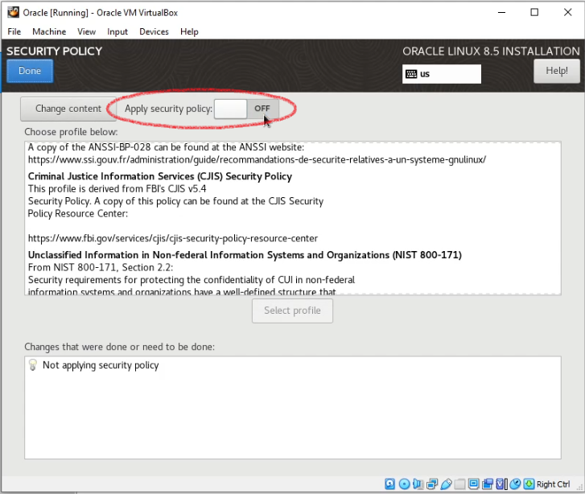
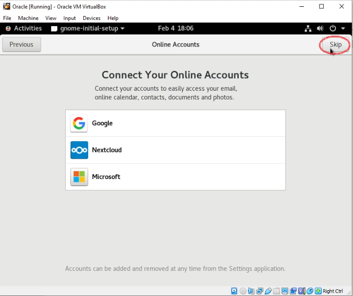

# Getting started with **Oracle Linux** 
[Oracle] | [ISO Download] | [Virtualbox Download]

**Below, you will find a detailed walkthrough installation of Oracle Linux in Virtualbox.  This was done using VirtualBox version 6.1.32, and Oracle Linux 8.5 on February 4, 2022. Please [email] me with any questions, concerns, or feedback.** 

`Please note:` *this is with absolute beginners in mind*.

  

 

## Start by downloading the tools

Locate the appropriate Oracle Linux ISO, [Iso Download], for your setup.

Download the latest [Virtualbox Download] binary. _**(Skip if you already have Virtualbox)**_

Install Virtualbox _**(Again, skip if you already have)**_

---
 

## Install Oracle Linux in VirtualBox

You'll want to begin by opening up Virtualbox.  Click **new** as outlined with a *red circle* below.

 </a>&nbsp; &nbsp; 

 

I'll be using **Expert Mode** in this installation.

---

## Name and Operating System
- **Name:** Oracle
    - Name this whatever you like
- **Machine Folder:** D:\VMs
    - Store your virtual machine in a location that has available space.  In my situation I use a dedicated solid state drive for virtual machines, which is, my D:\ is in this scenario.
- **Type:** Linux
    - This is a Linux distro
- **Version:** Oracle(64-bit)
    - This will work if you select other choices; however, Oracle is the version so I do suggest using it.

**Memory Size**
- Select the amount of memory you are able to dedicate to the virtual machine.  In my case I've selected **8192 mb** which is about *8gb* of memory.

**Hard Disk**
- For the purpose of this walkthrough, I am, *creating a new virtual disk*.

Click **Create** as outlined in red below.

 </a>&nbsp; &nbsp; 

 

---

## Create Virtual Hard Disk

**File Location:**
- Ensure this matches the location you would like to store the `virtual disk`.

**File Size:**
- Set the amount that you are able to allocate to your virtual machine.
    - I selected to use 200gb, but this is for my own use case. **Don't** let this determine your selection.

**Hard Disk File Type**
- I'm using **VDI**
    - *This may vary for your use case. Refer to documentation regarding questions/concerns*.

**Storage on physical hard disk**
- I'll be using **Dynamically Allocated**
    - If you have a use case for *Fixed Size* then use that.

Continue by clicking by clicking **Create** after reviewing the information, and ensuring the settings to be satisfactory.

 </a>&nbsp; &nbsp; 

 

---

## Settings

Clicking the gear icon with *"Settings"* under, circled in the photo below in red, will open up the settings of your virtual machine.

 

 </a>&nbsp; &nbsp; 

 

## System
We'll start with going into **System** as circled in the image below.

 

 </a>&nbsp; &nbsp; 

 

I like to uncheck the floppy and move it to the bottom of the boot order.  It's really just a preference, and not necessary.

Do ensure the memory is what you set earlier, or modify it here while in the **Motherboard** tab.

 

 </a>&nbsp; &nbsp; 

 

Next navigate over to the **Processor** tab, as seen below.

 

 </a>&nbsp; &nbsp; 

 

I'm able to allocate 4 cores to this virtual machine. You will need to decide on what **CPU** resources to allocate to your virtual machine.  Please read the documentation regarding any questions or concerns here [Oracle]. I make no changes to the execution cap for my use case, and leave the extended features on default settings. If your default settings are different, again, please visit Oracle to locate settings partiuclar to your environment.

 

 </a>&nbsp; &nbsp; 

 

## Display 
Next we'll navigate over to the **Display** settings, which I’ve circled in red below.

 

 </a>&nbsp; &nbsp; 

 

**Screen**
- Video Memory
    - I set it to maximum, but you need to determine the graphic memory resources you wish to allocate.
- Monitor Count
    - I have dual displays, but only utilize 1 for my virtual machine.  Set this accordingly.
- Scale Factor
    - `no changes`
- Graphics Controller
    - You may consider changing this option.
- Acceleration
    - You could enable 3d acceleration.

Remote Display
- `no changes`

Recording
- `no changes`

 

 </a>&nbsp; &nbsp; 

 

## Storage

- Controller IDE

- Controller SATA

- Attributes

 

 </a>&nbsp; &nbsp; 

 

**Controller IDE**

- Empty Disc
    - Click the empty disc icon to highlight the item as seen below.

 

 </a>&nbsp; &nbsp; 

 

- Attributes
    - Select the disc icon to insert the ISO image you downloaded from [Iso Download].
        - Use the drop down menu to navigate to the location where you saved the ISO image.

 

 </a>&nbsp; &nbsp; 

 

You should observe the ISO image populated into the **Controller IDE** now.

 

 </a>&nbsp; &nbsp; 

 

## Network

You may need to adjust this, but remember **wifi** will not be accessible using Oracle Linux by default.

 

 </a>&nbsp; &nbsp; 

 

From here I will select **General** on the left, and **Ok** at the bottom to conclude my initial settings.

 

 </a>&nbsp; &nbsp; 

 

---

## Start Installation Process

Click **Start** at the top to start the virtual machine, and begin our installation process.

 

 </a>&nbsp; &nbsp; 

 

Install Oracle Linux 8.5.0

 

 </a>&nbsp; &nbsp; 

 

You should see the installer initialize.

 

 </a>&nbsp; &nbsp; 

 

---

## Welcome to Oracle Linux

Select your language, and **Continue** as circled in the image below.

 

 </a>&nbsp; &nbsp; 

 

**Installation Summary**

We'll navigate some of these options to set up for our use case.

 

 </a>&nbsp; &nbsp; 

 

Starting here with **Root Password**.

 

 </a>&nbsp; &nbsp; 

 

Make sure to create a strong password.

 

 </a>&nbsp; &nbsp; 

 

Next **Software Selection**.

 

 </a>&nbsp; &nbsp; 

 

For testing purposes I'm just doing **workstation**, but feel free to experiment and use what you may want to test software wise here. There are lots of selections to choose from.

 

 </a>&nbsp; &nbsp; 

 

After making your selections, select **Done** as shown in the image below.

 

 </a>&nbsp; &nbsp; 

 

Then onto **Installation Destination**.

 

 </a>&nbsp; &nbsp; 

 

You'll want to make sure that the hard disk selected is blue and has the **check** mark as seen in the image below.

 

 </a>&nbsp; &nbsp; 

 

Then select **Done**.

 

 </a>&nbsp; &nbsp; 

 

Next navigate over to **Security Policy**.

 

 </a>&nbsp; &nbsp; 

 

Here you can select a **security policy**.

 

 </a>&nbsp; &nbsp; 

 

For now I will select **OFF** at **Apply security policy**.

 

 </a>&nbsp; &nbsp; 

 

`Important` Network, by default, will not automatically connect to ethernet if you do not select this option and enable it.

 

 </a>&nbsp; &nbsp; 

 

Make sure to enable this option circled below by selecting **ON** for ethernet.  If you do not do this you will need to do it after installation, or manually connect each time.

 

 </a>&nbsp; &nbsp; 

 

Then select **Done**.

 

 </a>&nbsp; &nbsp; 

 

---

## Begin Installation

It's time to begin the installation, when you are done going through the selections, and setting up.

 

 </a>&nbsp; &nbsp; 

 

This will take some time depending on the choices you made prior. You will want to click **Reboot System** as circled below, when the **Installation Progress** is complete.

 

 </a>&nbsp; &nbsp; 

 

You'll have the following selections after the system reboot:
- Licensing
    - License Information
- User Settings
    - User Creation

We'll go into **Licensing** first.

 

 </a>&nbsp; &nbsp; 

 

You'll need to accept the agreement before proceeding. You may wish to read the licensing here as well.

 

 </a>&nbsp; &nbsp; 

 

Select **Done** to exit the licensing.

 

 </a>&nbsp; &nbsp; 

 

Next we will select **User Creation**.

 

 </a>&nbsp; &nbsp; 

 

Setup your user credentials here.  I'm making this user an **administrator** for testing purposes. I've also selected to **require password** for this user. 

Select **Done** as circled below when finished.

 

 </a>&nbsp; &nbsp; 

 

Now **Finish Configuration**.

 

 </a>&nbsp; &nbsp; 

 

---

## Login

Login with the user you created.

 

 </a>&nbsp; &nbsp; 

 

 

 </a>&nbsp; &nbsp; 

 

You should be greeted by the desktop environment, if you selected a *GUI* install environment.

 

 </a>&nbsp; &nbsp; 

 

The gnome-initial-setup may also appear depending on your choices.  

 

 </a>&nbsp; &nbsp; 

 

 

 </a>&nbsp; &nbsp; 

 

Highlighted in **yellow** here, I show that, I turn off location services. This is something you need to decide for your own use case. What I am doing does not require this feature.

 

 </a>&nbsp; &nbsp; 

 

 

 </a>&nbsp; &nbsp; 

 

After selecting your options you are done, and ready to further use Oracle Linux.  

 

 </a>&nbsp; &nbsp; 

 

Oracle Linux provides **Getting Started Videos**. This content can later be found in **Help**.

 

 </a>&nbsp; &nbsp; 

 

---

[Oracle]: https://www.oracle.com/linux/
[ISO Download]: https://yum.oracle.com/oracle-linux-isos.html
[Virtualbox Download]: https://www.virtualbox.org/wiki/Downloads
[email]: mailto:attacktheosi@gmail.com

